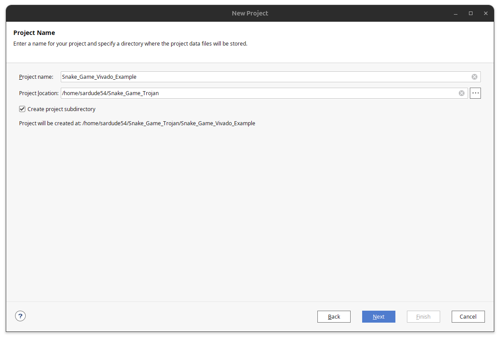
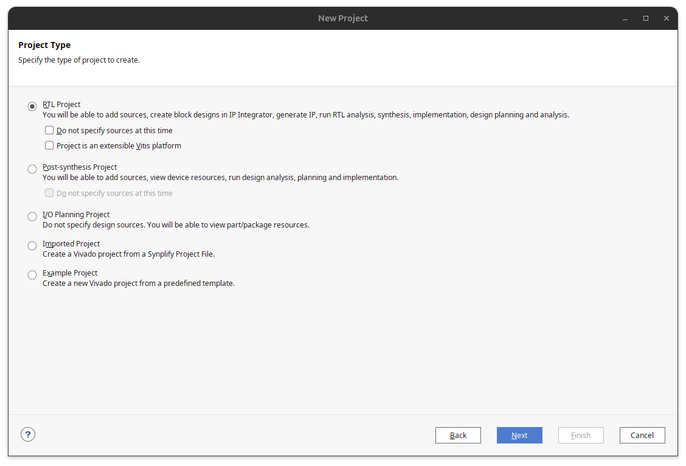
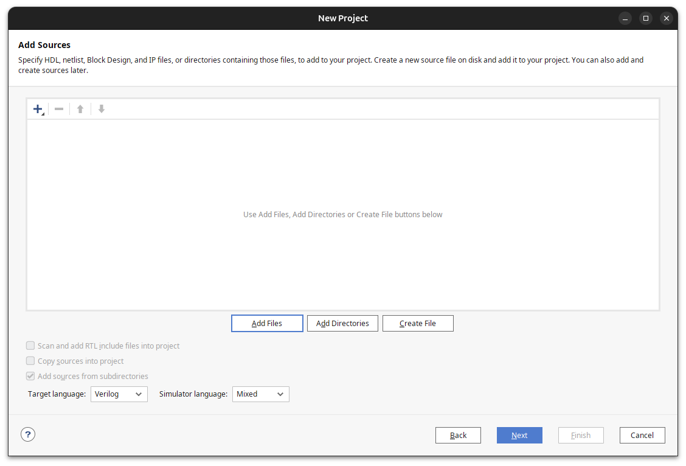
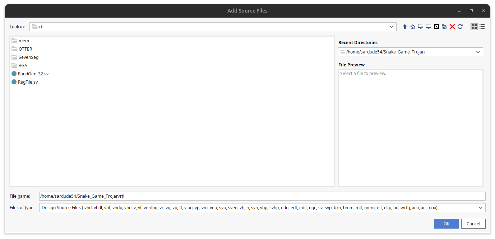
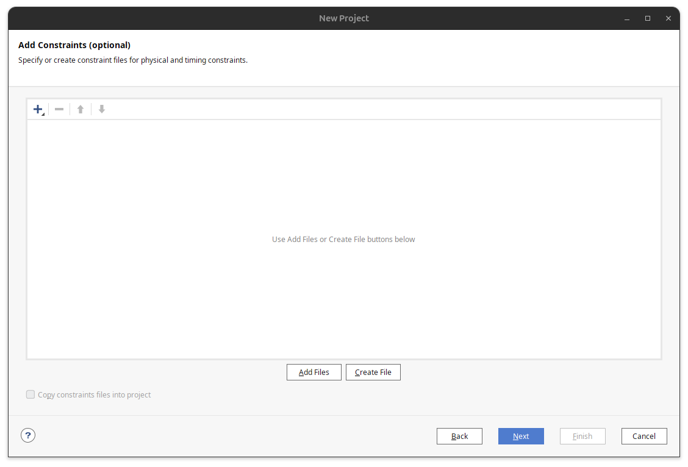
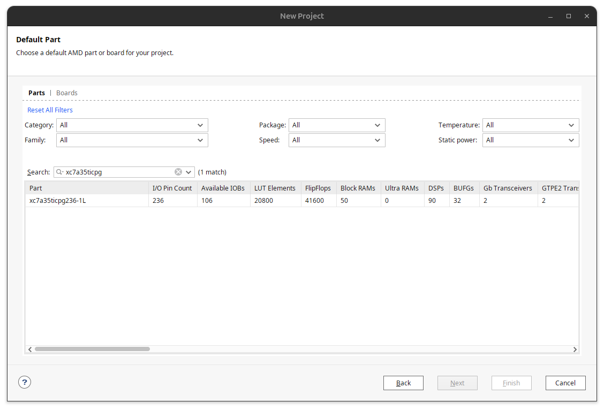

# CPE-426 Hardware Security Final Project - Snake Game

This repository contains a course project demonstrating a hardware trojan
inserted into a custom RISC-V FPGA design for educational hardware security project.

This project:
- Only targets a snake implementation on a RISC-V core on the Basys3 FPGA board

The trojan technique is demonstrated to study detection, mitigation, and secure hardware design practices.

# Table of Contents

- [Introduction](#introduction)
- [Project Structure](#project-strucure)
    - [Required Hardware and Software](#required-hardware-and-software)
    - [Game Controls](#game-controls)
- [How to Setup Vivado Project](#how-to-setup-vivado-project)
- [How to Setup RISC-V Toolchain](#how-to-setup-risc-v-toolchain)
# Introduction
This project is an implementation of a hardware trojan only on the Basys3 FPGA board. 

It is best to run this project on WSL or Linux in order to run RISC-V toolchain. 

## Required Hardware and Software

## Game Controls

# Project Strucure

# How to Setup Vivado Project
1. Create your RTL project at the base repo

2. Select RTL project

3. Add sources from /rtl

Add all of the System Verilog, Verilog, and memory files

4. Add constraints file (peripherals already setup. Do not modify)

5. Select correct FPGA board (xc7a35ticpg)

6. Once project is generated, add the sim file from the /sim folder
    - Similar to adding sources
    - Select "Added Source"
    - Select "Add or create simulation sources"

Once your Vivado project is setup, you can proceed to simulate, synthesize, and generate bit stream. 

# How to Setup RISC-V ToolChain
1. Download dependecies
    - `sudo apt update`
    - `apt install -y libmpc3 libmpfr6 libgmp10 make`
2. Setup script for project
    - `cd programs`
    - `source scripts/env.sh`
2. Build the snake game
    - `cd programs/snake_game`
    - `make clean`
    - `make`
4. The snake game should already be in the RTL .mem file. If not, copy and paste contents from programs/snake_game/build/mem.txt to the .mem file on the RTL project. Generated the bit stream again and load on to the board. 
5. (Optional) If you want create your own software projects run (not necessary for this trojan) `create_project_asm myproj`
    - Or a C project, run `create_project_c myproj`
    - Be sure to change src/init.s to call _start instead of main for a C project